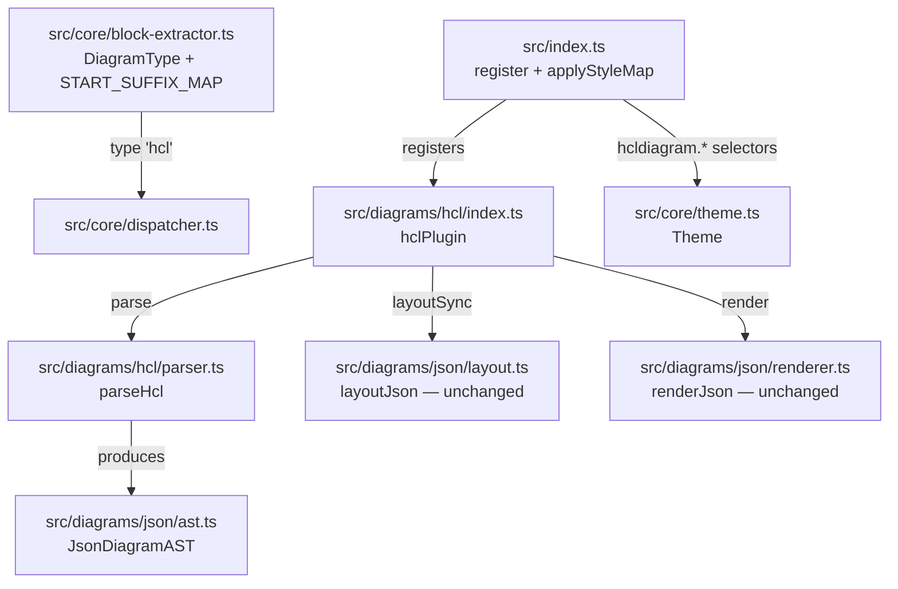

# Component Map

## Write-set by batch

| Batch | Files written |
|-------|--------------|
| T1 | `src/diagrams/hcl/parser.ts`, `src/core/block-extractor.ts`, `tests/unit/hcl/parser.test.ts` |
| T2 | `src/diagrams/hcl/index.ts`, `src/index.ts`, `tests/unit/hcl/plugin.test.ts`, `tests/visual/hcl.html`, `DIVERGENCES.md` |
