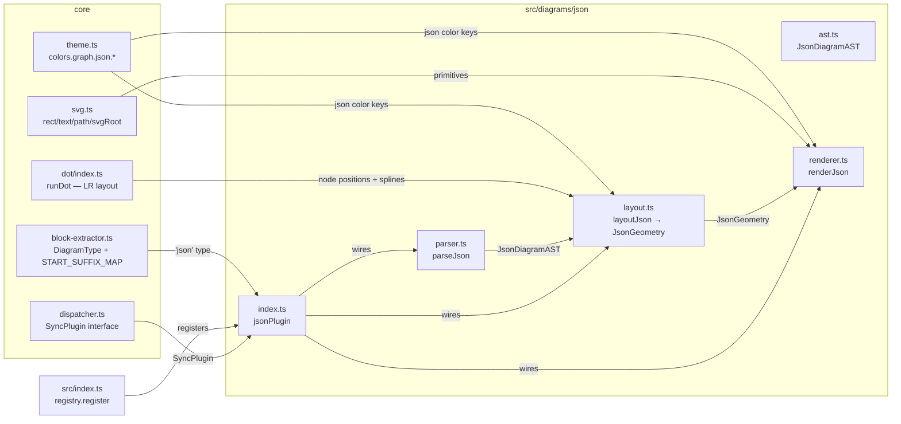

# Component Map

```mermaid
graph LR
  subgraph core
    BE[block-extractor.ts\nDiagramType + START_SUFFIX_MAP]
    TH[theme.ts\ncolors.graph.json.*]
    DOT[dot/index.ts\nrunDot — LR layout]
    SVG[svg.ts\nrect/text/path/svgRoot]
    DISP[dispatcher.ts\nSyncPlugin interface]
  end

  subgraph json [src/diagrams/json]
    AST[ast.ts\nJsonDiagramAST]
    PARSER[parser.ts\nparseJson]
    LAYOUT[layout.ts\nlayoutJson → JsonGeometry]
    RENDERER[renderer.ts\nrenderJson]
    PLUGIN[index.ts\njsonPlugin]
  end

  IDX[src/index.ts\nregistry.register]

  BE -->|'json' type| PLUGIN
  TH -->|json color keys| LAYOUT
  TH -->|json color keys| RENDERER
  DOT -->|node positions + splines| LAYOUT
  SVG -->|primitives| RENDERER

  PARSER -->|JsonDiagramAST| LAYOUT
  LAYOUT -->|JsonGeometry| RENDERER
  PLUGIN -->|wires| PARSER
  PLUGIN -->|wires| LAYOUT
  PLUGIN -->|wires| RENDERER
  IDX -->|registers| PLUGIN
  DISP -->|SyncPlugin| PLUGIN
```
