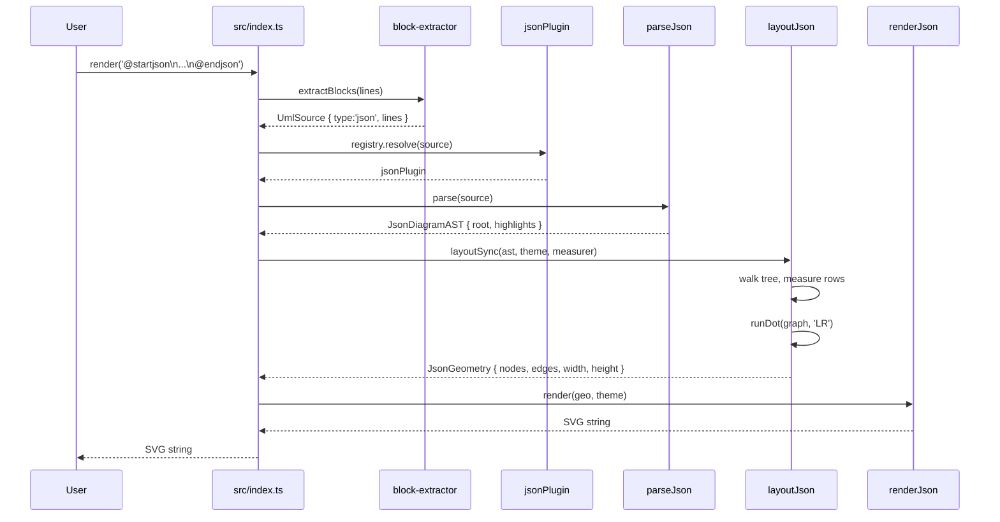

# Data Flow

```mermaid
sequenceDiagram
  participant User
  participant index as src/index.ts
  participant BE as block-extractor
  participant Plugin as jsonPlugin
  participant Parser as parseJson
  participant Layout as layoutJson
  participant Renderer as renderJson

  User->>index: render('@startjson\n...\n@endjson')
  index->>BE: extractBlocks(lines)
  BE-->>index: UmlSource { type:'json', lines }
  index->>Plugin: registry.resolve(source)
  Plugin-->>index: jsonPlugin
  index->>Parser: parse(source)
  Parser-->>index: JsonDiagramAST { root, highlights }
  index->>Layout: layoutSync(ast, theme, measurer)
  Layout->>Layout: walk tree, measure rows
  Layout->>Layout: runDot(graph, 'LR')
  Layout-->>index: JsonGeometry { nodes, edges, width, height }
  index->>Renderer: render(geo, theme)
  Renderer-->>index: SVG string
  index-->>User: SVG string
```
