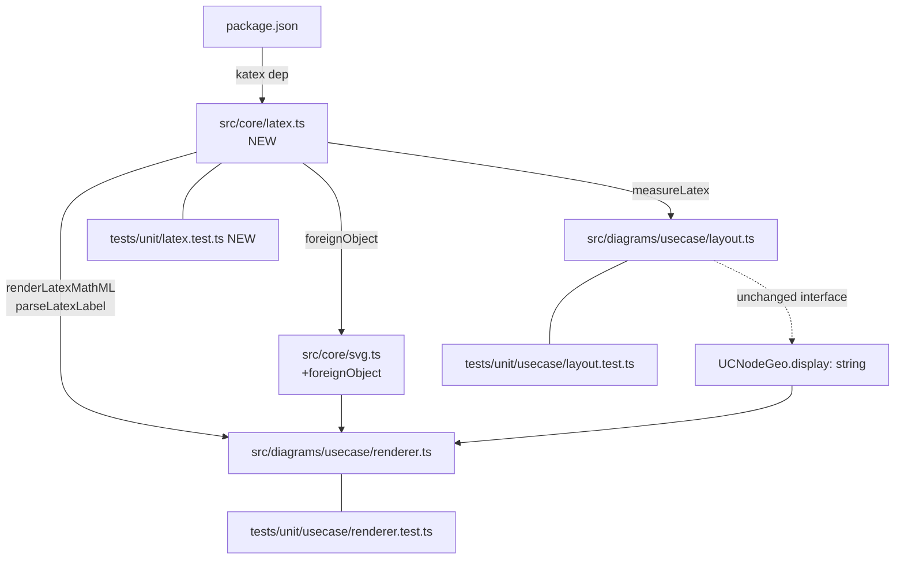

```mermaid
graph TD
    PKG[package.json] -->|katex dep| LATEX
    LATEX[src/core/latex.ts<br/>NEW] -->|foreignObject| SVG[src/core/svg.ts<br/>+foreignObject]
    LATEX -->|measureLatex| LAYOUT[src/diagrams/usecase/layout.ts]
    LATEX -->|renderLatexMathML<br/>parseLatexLabel| RENDERER[src/diagrams/usecase/renderer.ts]
    SVG --> RENDERER

    LAYOUT -.->|unchanged interface| GEO[UCNodeGeo.display: string]
    GEO --> RENDERER

    LATEX --- T1_TEST[tests/unit/latex.test.ts NEW]
    LAYOUT --- T2_TEST[tests/unit/usecase/layout.test.ts]
    RENDERER --- T3_TEST[tests/unit/usecase/renderer.test.ts]
```
