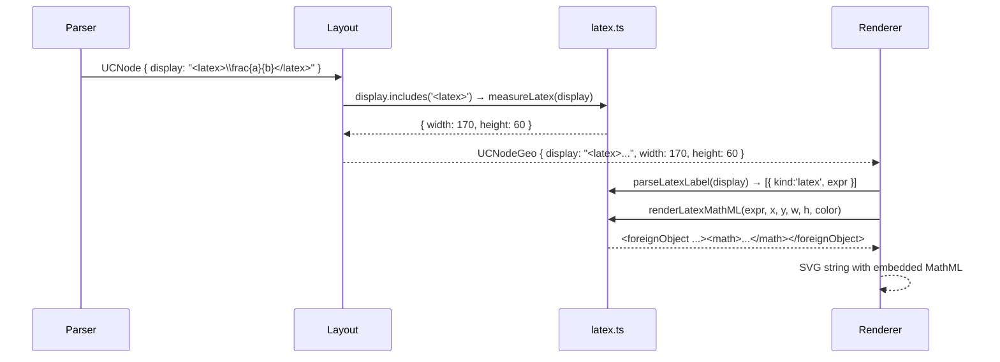

```mermaid
sequenceDiagram
    participant P as Parser
    participant L as Layout
    participant LA as latex.ts
    participant R as Renderer

    P->>L: UCNode { display: "<latex>\\frac{a}{b}</latex>" }
    L->>LA: display.includes('<latex>') → measureLatex(display)
    LA-->>L: { width: 170, height: 60 }
    L-->>R: UCNodeGeo { display: "<latex>...", width: 170, height: 60 }
    R->>LA: parseLatexLabel(display) → [{ kind:'latex', expr }]
    R->>LA: renderLatexMathML(expr, x, y, w, h, color)
    LA-->>R: <foreignObject ...><math>...</math></foreignObject>
    R-->>R: SVG string with embedded MathML
```
