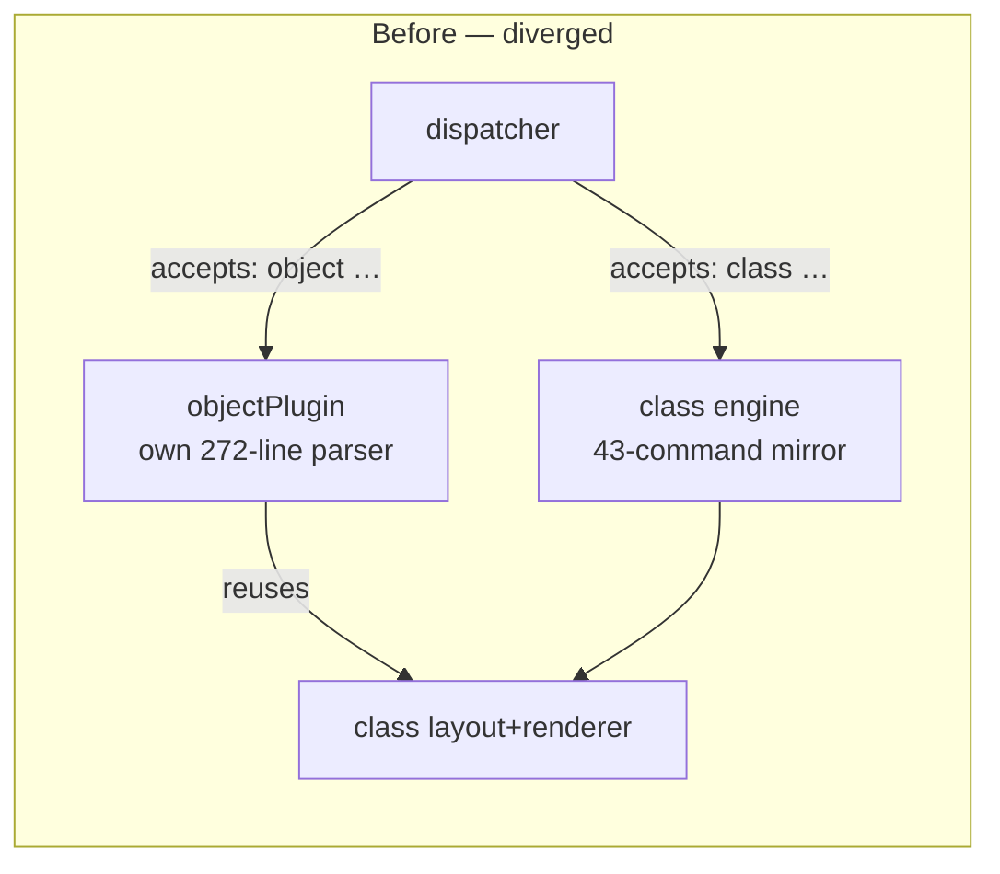
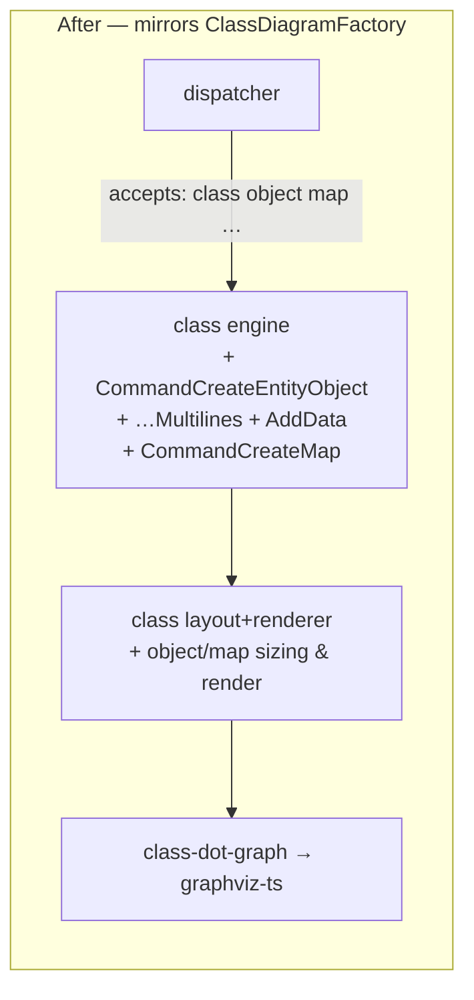

# Engine boundary — before / after

Upstream reference: `ClassDiagramFactory.java:81-85,116-117` registers
the object commands; `objectdiagram/` holds only
`AbstractClassOrObjectDiagram` + commands. Object diagrams are
`DiagramType.CLASS` (SVG `data-diagram-type="CLASS"`).
