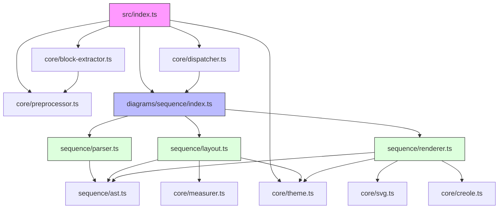

# Component Map — Phase 1 Dependencies

## Module responsibilities

| Module | Responsibility |
|--------|---------------|
| `index.ts` | Public API — `render()`, `renderSync()`, `renderAll()` |
| `preprocessor.ts` | `!define`, `!ifdef`, comment stripping |
| `block-extractor.ts` | `@startuml…@enduml` detection + type probe |
| `dispatcher.ts` | Plugin registry + type → plugin lookup |
| `theme.ts` | `Theme` type + `default` and `dark` built-ins |
| `measurer.ts` | `StringMeasurer` interface + `FormulaMeasurer` |
| `svg.ts` | SVG string primitives (rect, line, text, path, group) |
| `creole.ts` | Creole markup → `<tspan>` elements |
| `sequence/ast.ts` | All sequence AST and Geometry types |
| `sequence/parser.ts` | Command dispatch → `SequenceDiagramAST` |
| `sequence/layout.ts` | `SequenceDiagramAST` → `SequenceGeometry` |
| `sequence/renderer.ts` | `SequenceGeometry` → SVG string |
| `sequence/index.ts` | `DiagramPlugin` wiring |
