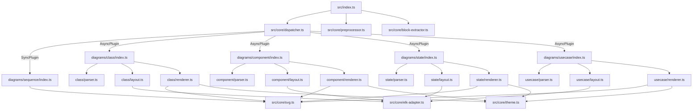

# Component Map — Phase 2

```mermaid
graph TD
    API[src/index.ts] --> DISP[src/core/dispatcher.ts]
    API --> PRE[src/core/preprocessor.ts]
    API --> BE[src/core/block-extractor.ts]

    DISP -->|SyncPlugin| SEQ[diagrams/sequence/index.ts]
    DISP -->|AsyncPlugin| CLS[diagrams/class/index.ts]
    DISP -->|AsyncPlugin| COMP[diagrams/component/index.ts]
    DISP -->|AsyncPlugin| ST[diagrams/state/index.ts]
    DISP -->|AsyncPlugin| UC[diagrams/usecase/index.ts]

    CLS --> CLS_P[class/parser.ts]
    CLS --> CLS_L[class/layout.ts]
    CLS --> CLS_R[class/renderer.ts]

    COMP --> COMP_P[component/parser.ts]
    COMP --> COMP_L[component/layout.ts]
    COMP --> COMP_R[component/renderer.ts]

    ST --> ST_P[state/parser.ts]
    ST --> ST_L[state/layout.ts]
    ST --> ST_R[state/renderer.ts]

    UC --> UC_P[usecase/parser.ts]
    UC --> UC_L[usecase/layout.ts]
    UC --> UC_R[usecase/renderer.ts]

    CLS_L --> ELK[src/core/elk-adapter.ts]
    COMP_L --> ELK
    ST_L --> ELK
    UC_L --> ELK

    CLS_R --> SVG[src/core/svg.ts]
    COMP_R --> SVG
    ST_R --> SVG
    UC_R --> SVG
    SEQ --> SVG

    CLS_R --> THEME[src/core/theme.ts]
    COMP_R --> THEME
    ST_R --> THEME
    UC_R --> THEME
```
