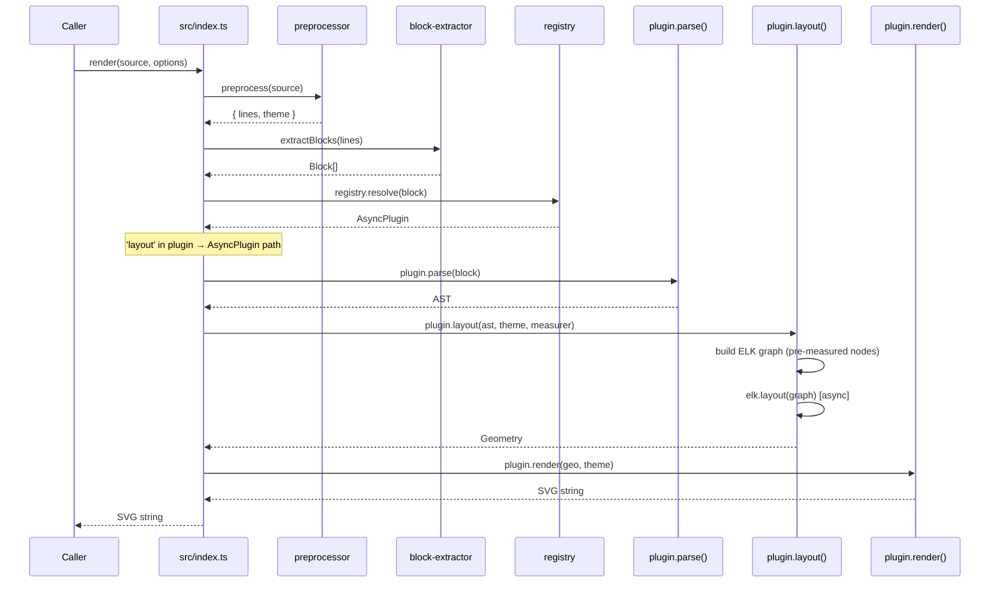
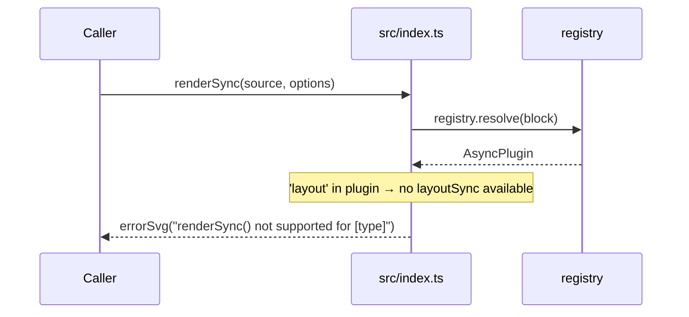

# Data Flow — Phase 2 Async Render Pipeline

```mermaid
sequenceDiagram
    participant C as Caller
    participant API as src/index.ts
    participant Pre as preprocessor
    participant BE as block-extractor
    participant Reg as registry
    participant P as plugin.parse()
    participant L as plugin.layout()
    participant R as plugin.render()

    C->>API: render(source, options)
    API->>Pre: preprocess(source)
    Pre-->>API: { lines, theme }
    API->>BE: extractBlocks(lines)
    BE-->>API: Block[]
    API->>Reg: registry.resolve(block)
    Reg-->>API: AsyncPlugin

    note over API: 'layout' in plugin → AsyncPlugin path
    API->>P: plugin.parse(block)
    P-->>API: AST
    API->>L: plugin.layout(ast, theme, measurer)
    L->>L: build ELK graph (pre-measured nodes)
    L->>L: elk.layout(graph) [async]
    L-->>API: Geometry
    API->>R: plugin.render(geo, theme)
    R-->>API: SVG string
    API-->>C: SVG string
```

## renderSync() path for AsyncPlugin

```mermaid
sequenceDiagram
    participant C as Caller
    participant API as src/index.ts
    participant Reg as registry

    C->>API: renderSync(source, options)
    API->>Reg: registry.resolve(block)
    Reg-->>API: AsyncPlugin
    note over API: 'layout' in plugin → no layoutSync available
    API-->>C: errorSvg("renderSync() not supported for [type]")
```
