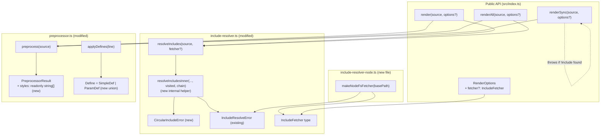

# Component Map — Preprocessor

```mermaid
graph TD
    subgraph "Public API (src/index.ts)"
        render["render(source, options?)"]
        renderAll["renderAll(source, options?)"]
        renderSync["renderSync(source, options?)"]
        RenderOptions["RenderOptions\n+ fetcher?: IncludeFetcher"]
    end

    subgraph "include-resolver.ts (modified)"
        resolveIncludes["resolveIncludes(source, fetcher?)"]
        resolveIncludesInner["resolveIncludesInner(..., visited, chain)\n(new internal helper)"]
        CircularIncludeError["CircularIncludeError (new)"]
        IncludeResolveError["IncludeResolveError (existing)"]
        IncludeFetcher["IncludeFetcher type"]
    end

    subgraph "include-resolver-node.ts (new file)"
        makeNodeFsFetcher["makeNodeFsFetcher(basePath)"]
    end

    subgraph "preprocessor.ts (modified)"
        preprocess["preprocess(source)"]
        PreprocessorResult["PreprocessorResult\n+ styles: readonly string[] (new)"]
        applyDefines["applyDefines(line)"]
        Define["Define = SimpleDef | ParamDef (new union)"]
    end

    render --> resolveIncludes
    renderAll --> resolveIncludes
    renderSync -. "throws if !include found" .-> renderSync
    render --> preprocess
    renderAll --> preprocess
    renderSync --> preprocess

    resolveIncludes --> resolveIncludesInner
    resolveIncludesInner --> CircularIncludeError
    resolveIncludesInner --> IncludeResolveError

    makeNodeFsFetcher --> IncludeFetcher
    makeNodeFsFetcher --> IncludeResolveError

    RenderOptions --> IncludeFetcher
    preprocess --> PreprocessorResult
    applyDefines --> Define
```
