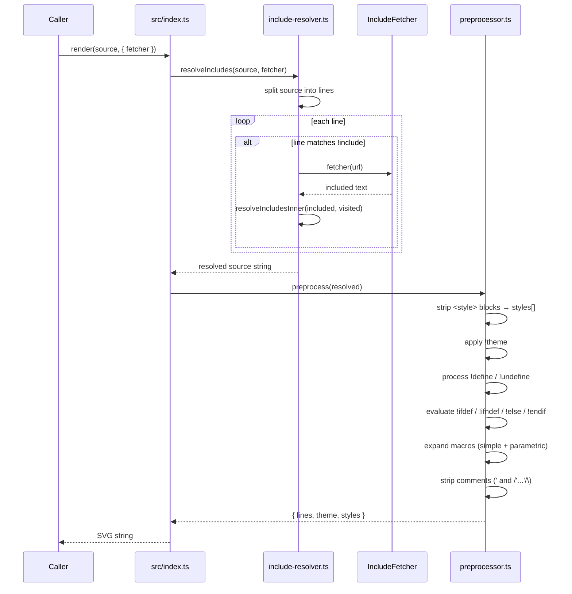
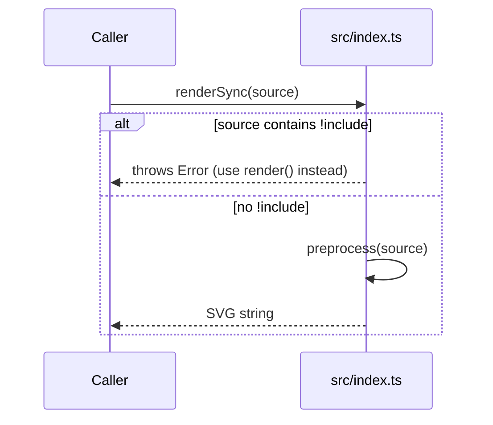
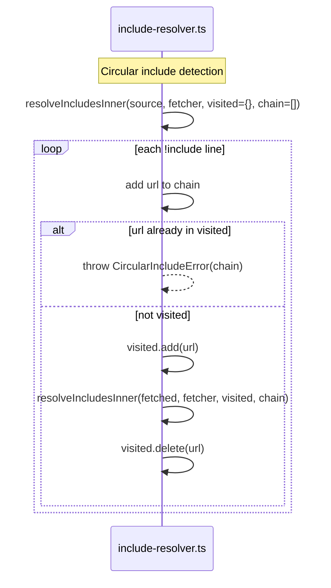

# Data Flow — Preprocessor Pipeline

```mermaid
sequenceDiagram
    participant Caller
    participant index as src/index.ts
    participant resolver as include-resolver.ts
    participant fetcher as IncludeFetcher
    participant preprocessor as preprocessor.ts

    Caller->>index: render(source, { fetcher })
    index->>resolver: resolveIncludes(source, fetcher)
    resolver->>resolver: split source into lines
    loop each line
        alt line matches !include
            resolver->>fetcher: fetcher(url)
            fetcher-->>resolver: included text
            resolver->>resolver: resolveIncludesInner(included, visited)
        end
    end
    resolver-->>index: resolved source string
    index->>preprocessor: preprocess(resolved)
    preprocessor->>preprocessor: strip <style> blocks → styles[]
    preprocessor->>preprocessor: apply !theme
    preprocessor->>preprocessor: process !define / !undefine
    preprocessor->>preprocessor: evaluate !ifdef / !ifndef / !else / !endif
    preprocessor->>preprocessor: expand macros (simple + parametric)
    preprocessor->>preprocessor: strip comments (' and /'...'/\)
    preprocessor-->>index: { lines, theme, styles }
    index-->>Caller: SVG string
```

```mermaid
sequenceDiagram
    participant Caller
    participant index as src/index.ts

    Caller->>index: renderSync(source)
    alt source contains !include
        index-->>Caller: throws Error (use render() instead)
    else no !include
        index->>index: preprocess(source)
        index-->>Caller: SVG string
    end
```

```mermaid
sequenceDiagram
    participant resolver as include-resolver.ts
    note over resolver: Circular include detection

    resolver->>resolver: resolveIncludesInner(source, fetcher, visited={}, chain=[])
    loop each !include line
        resolver->>resolver: add url to chain
        alt url already in visited
            resolver-->>resolver: throw CircularIncludeError(chain)
        else not visited
            resolver->>resolver: visited.add(url)
            resolver->>resolver: resolveIncludesInner(fetched, fetcher, visited, chain)
            resolver->>resolver: visited.delete(url)
        end
    end
```
