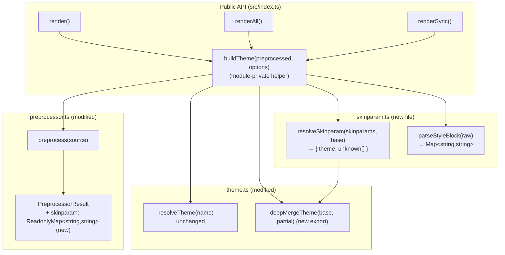

# Component Map — Skinparam

```mermaid
graph TD
    subgraph "Public API (src/index.ts)"
        render["render()"]
        renderAll["renderAll()"]
        renderSync["renderSync()"]
        buildTheme["buildTheme(preprocessed, options)\n(module-private helper)"]
    end

    subgraph "preprocessor.ts (modified)"
        preprocess["preprocess(source)"]
        PreprocessorResult["PreprocessorResult\n+ skinparam: ReadonlyMap&lt;string,string&gt; (new)"]
    end

    subgraph "theme.ts (modified)"
        resolveTheme["resolveTheme(name) — unchanged"]
        deepMergeTheme["deepMergeTheme(base, partial) (new export)"]
    end

    subgraph "skinparam.ts (new file)"
        resolveSkinparam["resolveSkinparam(skinparams, base)\n→ { theme, unknown[] }"]
        parseStyleBlock["parseStyleBlock(raw)\n→ Map&lt;string,string&gt;"]
    end

    render --> buildTheme
    renderAll --> buildTheme
    renderSync --> buildTheme

    buildTheme --> preprocess
    preprocess --> PreprocessorResult
    buildTheme --> resolveTheme
    buildTheme --> resolveSkinparam
    buildTheme --> parseStyleBlock
    buildTheme --> deepMergeTheme

    resolveSkinparam --> deepMergeTheme
```
