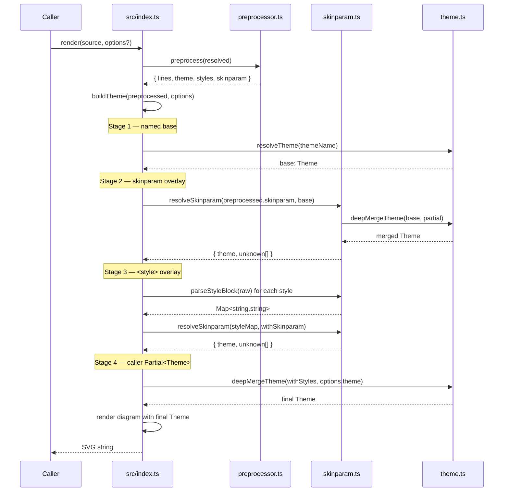

# Data Flow — Skinparam Pipeline

```mermaid
sequenceDiagram
    participant Caller
    participant index as src/index.ts
    participant preprocessor as preprocessor.ts
    participant skinparam as skinparam.ts
    participant theme as theme.ts

    Caller->>index: render(source, options?)
    index->>preprocessor: preprocess(resolved)
    preprocessor-->>index: { lines, theme, styles, skinparam }

    index->>index: buildTheme(preprocessed, options)

    note over index: Stage 1 — named base
    index->>theme: resolveTheme(themeName)
    theme-->>index: base: Theme

    note over index: Stage 2 — skinparam overlay
    index->>skinparam: resolveSkinparam(preprocessed.skinparam, base)
    skinparam->>theme: deepMergeTheme(base, partial)
    theme-->>skinparam: merged Theme
    skinparam-->>index: { theme, unknown[] }

    note over index: Stage 3 — <style> overlay
    index->>skinparam: parseStyleBlock(raw) for each style
    skinparam-->>index: Map<string,string>
    index->>skinparam: resolveSkinparam(styleMap, withSkinparam)
    skinparam-->>index: { theme, unknown[] }

    note over index: Stage 4 — caller Partial<Theme>
    index->>theme: deepMergeTheme(withStyles, options.theme)
    theme-->>index: final Theme

    index->>index: render diagram with final Theme
    index-->>Caller: SVG string
```
