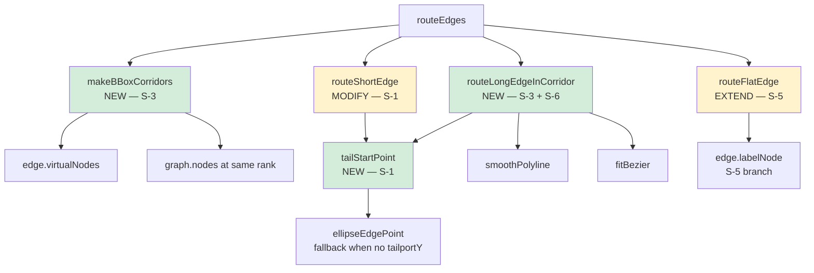

# Component Map — Affected Functions

```mermaid
graph TD
    RE[routeEdges] --> MBC[makeBBoxCorridors<br/>NEW — S-3]
    RE --> RLIC[routeLongEdgeInCorridor<br/>NEW — S-3 + S-6]
    RE --> RFE[routeFlatEdge<br/>EXTEND — S-5]
    RE --> RSE[routeShortEdge<br/>MODIFY — S-1]

    MBC --> VN[edge.virtualNodes]
    MBC --> GN[graph.nodes at same rank]

    RLIC --> TSP[tailStartPoint<br/>NEW — S-1]
    RLIC --> SM[smoothPolyline]
    RLIC --> FB[fitBezier]

    RSE --> TSP
    TSP --> EEP[ellipseEdgePoint<br/>fallback when no tailportY]

    RFE --> LN[edge.labelNode<br/>S-5 branch]

    style MBC fill:#d4edda
    style RLIC fill:#d4edda
    style TSP fill:#d4edda
    style RFE fill:#fff3cd
    style RSE fill:#fff3cd
```

Legend: green = new function, yellow = modified function, white = unchanged.
