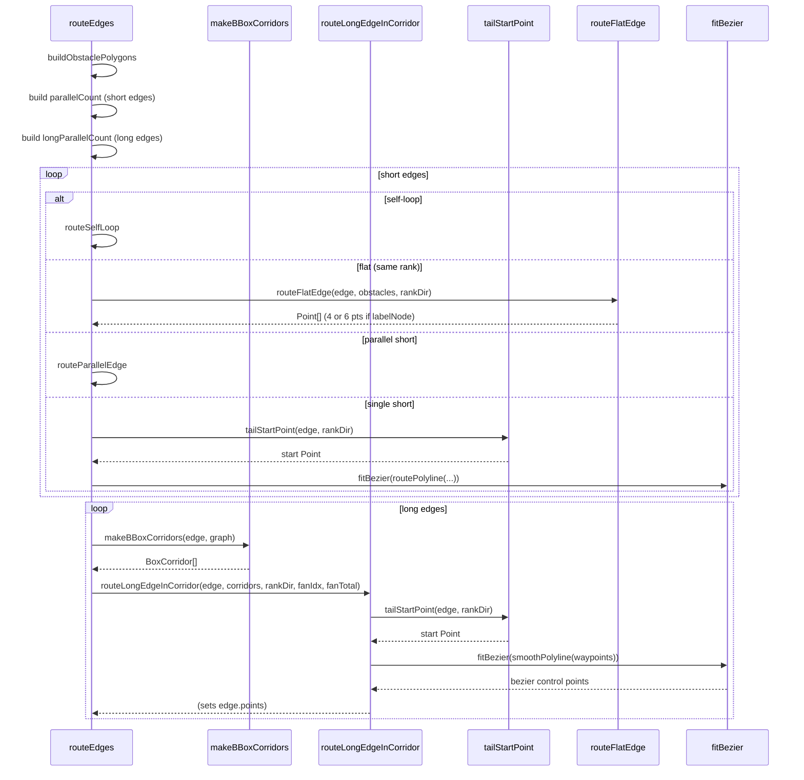

# Data Flow — splines.ts Routing Pipeline

```mermaid
sequenceDiagram
    participant RE as routeEdges
    participant MBC as makeBBoxCorridors
    participant RLIC as routeLongEdgeInCorridor
    participant TSP as tailStartPoint
    participant RFE as routeFlatEdge
    participant FB as fitBezier

    RE->>RE: buildObstaclePolygons
    RE->>RE: build parallelCount (short edges)
    RE->>RE: build longParallelCount (long edges)

    loop short edges
        alt self-loop
            RE->>RE: routeSelfLoop
        else flat (same rank)
            RE->>RFE: routeFlatEdge(edge, obstacles, rankDir)
            RFE-->>RE: Point[] (4 or 6 pts if labelNode)
        else parallel short
            RE->>RE: routeParallelEdge
        else single short
            RE->>TSP: tailStartPoint(edge, rankDir)
            TSP-->>RE: start Point
            RE->>FB: fitBezier(routePolyline(...))
        end
    end

    loop long edges
        RE->>MBC: makeBBoxCorridors(edge, graph)
        MBC-->>RE: BoxCorridor[]
        RE->>RLIC: routeLongEdgeInCorridor(edge, corridors, rankDir, fanIdx, fanTotal)
        RLIC->>TSP: tailStartPoint(edge, rankDir)
        TSP-->>RLIC: start Point
        RLIC->>FB: fitBezier(smoothPolyline(waypoints))
        FB-->>RLIC: bezier control points
        RLIC-->>RE: (sets edge.points)
    end
```
