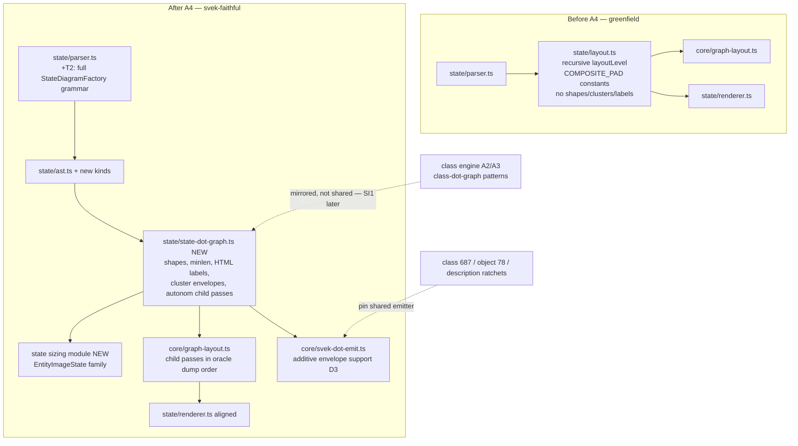

# Component map — state engine before/after

Oracle comparison flow (unchanged from A2/A3): renderSync →
setLayoutInputObserver captures each layout() call → toSvekDot →
compareStructural vs cached `svek-N.dot` (pairing graph #i ↔ svek-(i+1),
so child-pass ORDER matters — D2).
