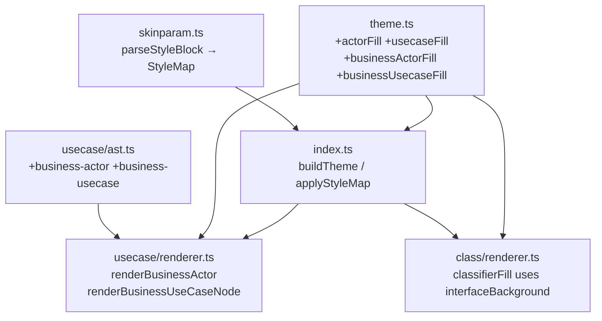

```mermaid
graph TD
    A[skinparam.ts<br/>parseStyleBlock → StyleMap] --> D[index.ts<br/>buildTheme / applyStyleMap]
    B[theme.ts<br/>+actorFill +usecaseFill<br/>+businessActorFill +businessUsecaseFill] --> D
    C[usecase/ast.ts<br/>+business-actor +business-usecase] --> E[usecase/renderer.ts<br/>renderBusinessActor<br/>renderBusinessUseCaseNode]
    B --> E
    D --> E
    D --> F[class/renderer.ts<br/>classifierFill uses interfaceBackground]
    B --> F
```
