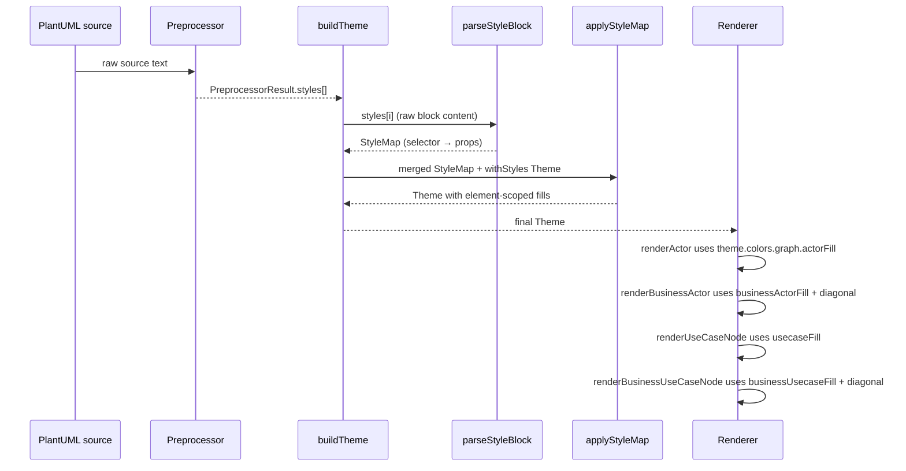

```mermaid
sequenceDiagram
    participant src as PlantUML source
    participant pp as Preprocessor
    participant bT as buildTheme
    participant pSB as parseStyleBlock
    participant aSM as applyStyleMap
    participant rend as Renderer

    src->>pp: raw source text
    pp-->>bT: PreprocessorResult.styles[]
    bT->>pSB: styles[i] (raw block content)
    pSB-->>bT: StyleMap (selector → props)
    bT->>aSM: merged StyleMap + withStyles Theme
    aSM-->>bT: Theme with element-scoped fills
    bT-->>rend: final Theme
    rend->>rend: renderActor uses theme.colors.graph.actorFill
    rend->>rend: renderBusinessActor uses businessActorFill + diagonal
    rend->>rend: renderUseCaseNode uses usecaseFill
    rend->>rend: renderBusinessUseCaseNode uses businessUsecaseFill + diagonal
```
