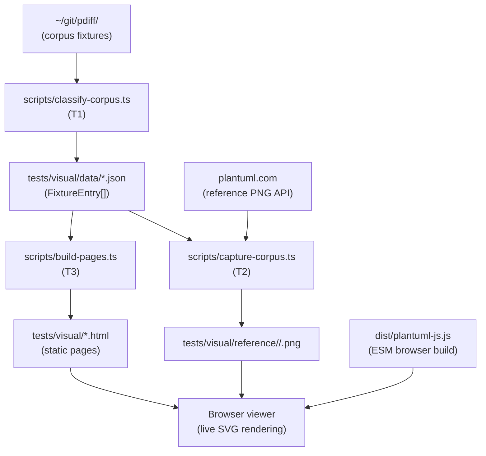

# Component Map

```mermaid
graph TD
    pdiff["~/git/pdiff/<br/>(corpus fixtures)"]
    classify["scripts/classify-corpus.ts<br/>(T1)"]
    manifests["tests/visual/data/*.json<br/>(FixtureEntry[])"]
    capture["scripts/capture-corpus.ts<br/>(T2)"]
    pngs["tests/visual/reference/<type>/<slug>.png"]
    plantumlcom["plantuml.com<br/>(reference PNG API)"]
    buildpages["scripts/build-pages.ts<br/>(T3)"]
    html["tests/visual/*.html<br/>(static pages)"]
    dist["dist/plantuml-js.js<br/>(ESM browser build)"]
    browser["Browser viewer<br/>(live SVG rendering)"]

    pdiff --> classify
    classify --> manifests
    manifests --> capture
    plantumlcom --> capture
    capture --> pngs
    manifests --> buildpages
    buildpages --> html
    pngs --> browser
    html --> browser
    dist --> browser
```
