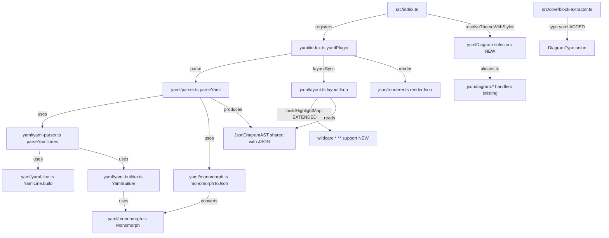

# Component Map

```mermaid
graph TD
    A[src/index.ts] -->|registers| B[yaml/index.ts yamlPlugin]
    A -->|resolveThemeWithStyles| C[yamlDiagram selectors NEW]

    B -->|parse| D[yaml/parser.ts parseYaml]
    B -->|layoutSync| E[json/layout.ts layoutJson]
    B -->|render| F[json/renderer.ts renderJson]

    D -->|uses| G[yaml/yaml-parser.ts parseYamlLines]
    D -->|uses| H[yaml/monomorph.ts monomorphToJson]
    D -->|produces| I[JsonDiagramAST shared with JSON]

    G -->|uses| J[yaml/yaml-line.ts YamlLine.build]
    G -->|uses| K[yaml/yaml-builder.ts YamlBuilder]
    K -->|uses| L[yaml/monomorph.ts Monomorph]
    H -->|converts| L

    E -->|buildHighlightMap EXTENDED| M[wildcard * ** support NEW]
    E -->|reads| I

    C -->|aliases to| N[jsondiagram.* handlers existing]

    O[src/core/block-extractor.ts] -->|type yaml ADDED| P[DiagramType union]
```
