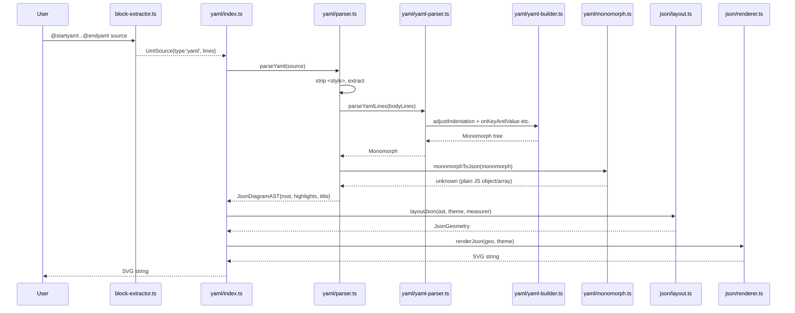

# Data Flow

```mermaid
sequenceDiagram
    participant User
    participant BlockExtractor as block-extractor.ts
    participant YamlPlugin as yaml/index.ts
    participant ParseYaml as yaml/parser.ts
    participant YamlParser as yaml/yaml-parser.ts
    participant YamlBuilder as yaml/yaml-builder.ts
    participant MonomorphToJson as yaml/monomorph.ts
    participant JsonLayout as json/layout.ts
    participant JsonRenderer as json/renderer.ts

    User->>BlockExtractor: @startyaml...@endyaml source
    BlockExtractor-->>YamlPlugin: UmlSource{type:'yaml', lines}

    YamlPlugin->>ParseYaml: parseYaml(source)
    ParseYaml->>ParseYaml: strip <style>, extract #highlight, title
    ParseYaml->>YamlParser: parseYamlLines(bodyLines)
    YamlParser->>YamlBuilder: adjustIndentation + onKeyAndValue etc.
    YamlBuilder-->>YamlParser: Monomorph tree
    YamlParser-->>ParseYaml: Monomorph
    ParseYaml->>MonomorphToJson: monomorphToJson(monomorph)
    MonomorphToJson-->>ParseYaml: unknown (plain JS object/array)
    ParseYaml-->>YamlPlugin: JsonDiagramAST{root, highlights, title}

    YamlPlugin->>JsonLayout: layoutJson(ast, theme, measurer)
    JsonLayout-->>YamlPlugin: JsonGeometry

    YamlPlugin->>JsonRenderer: renderJson(geo, theme)
    JsonRenderer-->>YamlPlugin: SVG string

    YamlPlugin-->>User: SVG string
```
